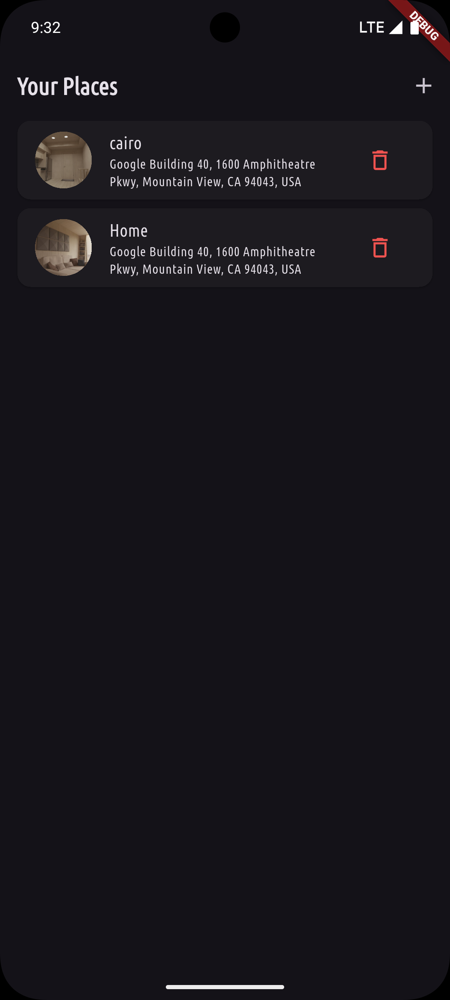
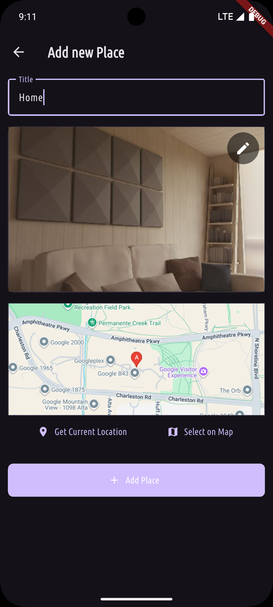
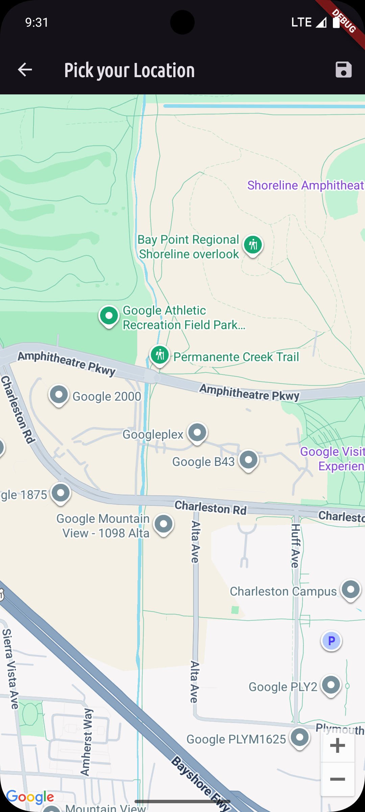
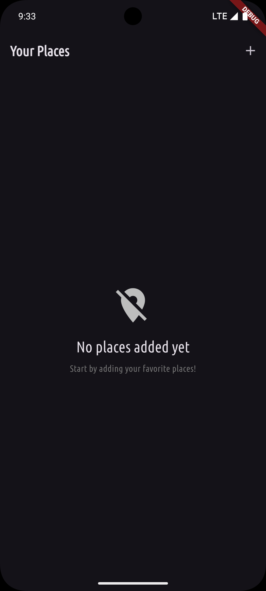
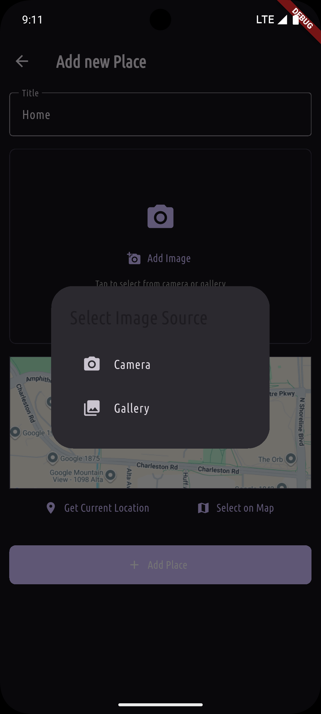
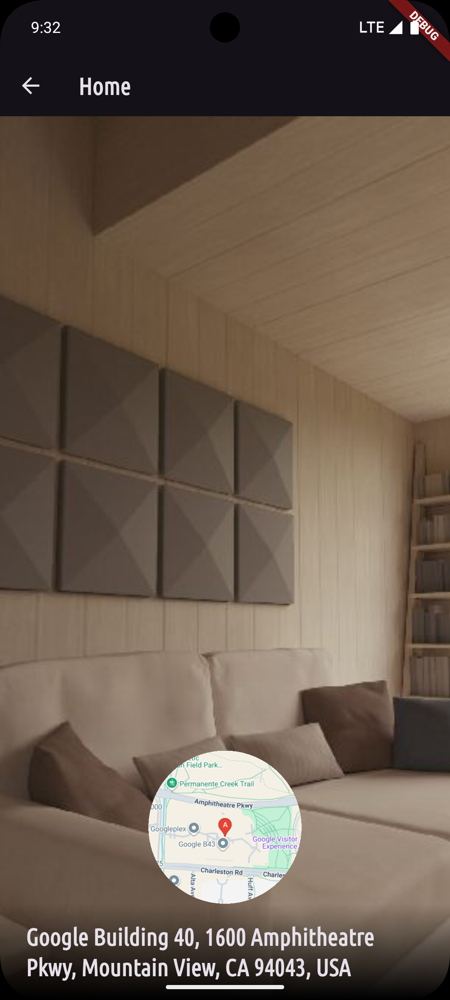

# 📍 Favorite Places

<div align="center">


[](https://github.com/mahmoudasal/Flutter_Favorite_places/stargazers)
[](https://github.com/mahmoudasal/Flutter_Favorite_places/network/members)
[](https://github.com/mahmoudasal/Flutter_Favorite_places/issues)
[](https://github.com/mahmoudasal/Flutter_Favorite_places/blob/main/LICENSE)

</div>

A beautiful, feature-rich Flutter application for managing and storing your favorite locations with images, GPS coordinates, and detailed information.

## ✨ Features

- **📱 Modern UI**: Clean, intuitive interface with dark theme and smooth animations
- **📸 Image Capture**: Take photos directly from camera or select from gallery
- **🗺️ Location Services**: GPS integration with Google Maps and geocoding
- **💾 Local Storage**: SQLite database for persistent data storage
- **🎯 Interactive Maps**: View and select locations on Google Maps
- **🔄 State Management**: Robust state management using Riverpod
- **⚡ Error Handling**: Comprehensive error handling and user feedback
- **🎨 Responsive Design**: Adaptive UI that works across different screen sizes

## 🛠️ Technical Stack

- **Framework**: Flutter 3.9+
- **State Management**: flutter_riverpod
- **Database**: SQLite (sqflite)
- **Maps**: Google Maps Flutter
- **Location**: location package
- **Image Handling**: image_picker
- **HTTP**: http package for geocoding
- **UI**: Material Design 3

## 📱 Screenshots

### Main Features Overview

<div align="center">

| Places List | Add New Place | Location Selection |
|:-----------:|:-------------:|:-----------------:|
|  |  |  |
| *Main screen showing saved favorite places* | *Form to add a new place with image and location* | *Interactive location selection with GPS* |

| Empty State | Image Selection | Place Details |
|:-----------:|:---------------:|:-------------:|
|  |  |  |
| *Helpful empty state with guidance* | *Camera and gallery options* | *Detailed view of a saved place* |

</div>

### Key Features Demonstrated

- **🏠 Places List**: Clean, modern interface showing all favorite places
- **➕ Add Place**: Intuitive form with image capture and location selection  
- **📍 Location Services**: GPS integration with Google Maps
- **📷 Image Handling**: Camera and gallery integration with preview
- **🗺️ Map Integration**: Interactive maps for location selection
- **⚠️ Error Handling**: User-friendly error states and validation
- **🎨 Material Design**: Modern UI following Material Design 3 principles

> **Note**: To add screenshots, run the app with your API key and capture screens:
> ```bash
> flutter run --dart-define=GOOGLE_MAPS_API_KEY=your_key
> ```
> Then add screenshots to the `screenshots/` folder and they'll appear here automatically.

## 🚀 Getting Started

### Prerequisites

- Flutter SDK (3.9.2 or higher)
- Dart SDK
- Android Studio / VS Code
- Google Maps API Key

### Installation

1. **Clone the repository**
   ```bash
   git clone https://github.com/mahmoudasal/Flutter_Favorite_places.git
   cd Flutter_Favorite_places
   ```

2. **Install dependencies**
   ```bash
   flutter pub get
   ```

3. **Setup Google Maps API**
   - Get your API key from [Google Cloud Console](https://console.cloud.google.com/)
   - Enable Maps SDK for Android, Geocoding API, and Static Maps API
   - See [SETUP.md](SETUP.md) for detailed configuration instructions

4. **Run the application**
   ```bash
   # With your Google Maps API key
   flutter run --dart-define=GOOGLE_MAPS_API_KEY=your_actual_api_key_here
   
   # Or use environment variables (see SETUP.md)
   flutter run
   ```

## 🏗️ Architecture

The app follows a clean architecture pattern with:

- **Models**: Data structures for Place and PlaceLocation
- **Providers**: State management using Riverpod NotifierProvider
- **Screens**: Full-screen UI components
- **Widgets**: Reusable UI components
- **Services**: Database and location services

### Project Structure
```
lib/
├── main.dart                 # App entry point
├── models/
│   └── place.dart           # Data models
├── providers/
│   └── user_places.dart     # State management
├── screens/
│   ├── places.dart          # Main places list
│   ├── add_place.dart       # Add new place
│   ├── place_detail.dart    # Place details
│   └── map.dart             # Map selection
└── widgets/
    ├── places_list.dart     # Places list widget
    ├── image_input.dart     # Image picker widget
    └── location_input.dart  # Location picker widget
```

## 🔧 Key Features Implementation

### State Management
- Uses `flutter_riverpod` with `NotifierProvider` pattern
- Immutable state updates with proper error handling
- Reactive UI updates based on state changes

### Database Operations
- SQLite integration with automatic schema creation
- CRUD operations with comprehensive error handling
- Image file management with cleanup

### Location Services
- GPS location detection with permission handling
- Google Maps integration for location selection
- Reverse geocoding for human-readable addresses
- Static map images for location preview

### Error Handling
- Custom exception classes for different error types
- User-friendly error messages with SnackBar notifications
- Graceful fallbacks for network and permission issues
- Comprehensive input validation

## 📋 Permissions

The app requires the following permissions:

- **INTERNET**: For Google Maps API calls
- **ACCESS_FINE_LOCATION**: For precise location detection
- **ACCESS_COARSE_LOCATION**: For approximate location detection
- **CAMERA**: For taking photos
- **READ_EXTERNAL_STORAGE**: For selecting images from gallery

## 🧪 Testing

Run tests with:
```bash
flutter test
```

## 🔄 Build & Release

### Debug Build
```bash
flutter build apk --debug
```

### Release Build
```bash
flutter build apk --release
```

## 📈 Performance Optimizations

- Efficient image handling with size limits and compression
- Lazy loading of images in lists
- Proper widget disposal to prevent memory leaks
- Database connection pooling
- Network request timeout handling

## 🤝 Contributing

1. Fork the project
2. Create your feature branch (`git checkout -b feature/AmazingFeature`)
3. Commit your changes (`git commit -m 'Add some AmazingFeature'`)
4. Push to the branch (`git push origin feature/AmazingFeature`)
5. Open a Pull Request

### 📸 Contributing Screenshots

To help improve the documentation:

1. **Run the app** with your API key:
   ```bash
   flutter run --dart-define=GOOGLE_MAPS_API_KEY=your_key
   ```

2. **Capture screenshots** of:
   - Main places list (with and without data)
   - Add place form (empty and filled)
   - Image selection dialog
   - Location picker interface
   - Error states and loading indicators
   - Place detail views

3. **Optimize images**:
   - Resize to reasonable dimensions (max 800px width)
   - Compress to keep file sizes under 500KB
   - Use PNG for UI screenshots, JPG for photos

4. **Save to screenshots folder** with descriptive names:
   - `places_list_with_data.png`
   - `add_place_form_empty.png`
   - `location_picker_loading.png`

5. **Update README.md** if adding new screenshot categories

## 📄 License

This project is licensed under the MIT License - see the [LICENSE](LICENSE) file for details.

## 👨‍💻 Author

**Mahmoud Asal**
- GitHub: [@mahmoudasal](https://github.com/mahmoudasal)
- LinkedIn: [mahmoudasal](https://linkedin.com/in/mahmoudasal)

## 🙏 Acknowledgments

- Flutter team for the amazing framework
- Google for Maps API and location services
- Riverpod team for excellent state management
- Open source community for the packages used

---

⭐ Star this repository if you found it helpful!
